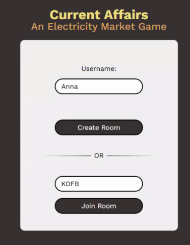
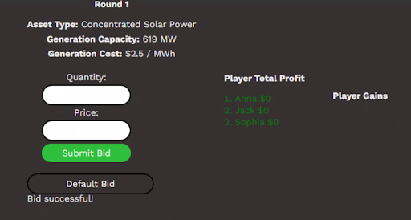

# Current Affairs - An Electricity Market Simulator
Current Affairs is an interactive electricity market simulator, where you’ll step into the role of a wholesale electricity trader. Using your laptop as a trading station, you’ll participate in online power exchange simulations that capture the impact of energy policies (taxes, subsidies) and uncertainties (heat waves, storms). Through multiple trading rounds, you’ll place bids, watch the market clear in real time, and see how prices, revenues, and other system outcomes shift under different scenarios. 

  
  
  

## For details on how to play the game, please visit:
1. Copy and paste the link shared into browser 
2. Enter name into the box

3. Type in the lobby code shared

4. Click join room
5. See the following screen

6. Once the administrator starts the game, we will have the following screen

7. Type in the quantity and the price or you can hit the default, under generation capacity and non-negative price. 
8. After every submitted we have the following screen

9. The users will then see the following screen

10. Each bar represents one player and hovering over the cursor shows the quantity and the price. The redline is the market price and the black line is the demand. Players to the left of the demand line are able to sell and are not kicked out of the market. If they are on the right of the demand line they are kicked out of the market because their price is too high and the cheaper generators are already able to sell.
11. The player total profit and the player gains shows the money a player earned so far throughout the game and the money a player earned in the last round. 

## Deployment

For deployment, we use the cloud service Heroku and the Heroku CLI.

### Setup

1. Create a new directory and clone the repository: `git clone git@github.com:tpayne52/current_affairs.git`

2. Sign up for a Heroku account through this [link](https://signup.heroku.com/login)

3. Install the Heroku CLI depending on your OS.

    - **macOS**: `brew install heroku/brew/heroku`
    
    - **Windows**: Go to the Heroku [CLI download page](https://devcenter.heroku.com/articles/heroku-cli#install-the-heroku-cli) and download the Windows installer. Run the installer and follow the instructions to install it.
    
    - **Ubuntu/Debian**: `curl https://cli-assets.heroku.com/install-ubuntu.sh | sh`

4. Use the `heroku --version` command to verify your Heroku CLI installation.

### Push Code to Heroku Server

5. Enter the directory with `cd current_affairs`

6. Using the Heroku CLI, log into your Heroku account using the `heroku login` command. This will open a browser window to authenticate your Heroku account.

7. Run `heroku create <your-app-name>` replace \<your-app-name\> with any name you want for the application.

8. Run `git remote -v` and ensure you are accessing the intended server; if not, run `heroku git:remote -a <your-app-name>`

9. **(Optional)** Heroku needs a Procfile to know how to run the application. A default one has already been created in the repository. If you want to customize your application further, you can edit the Procfile.

10. Ensure you are on the branch you would like to push to Heroku using `git branch -a`, for the version of the game with the most features, please be on the branch called 'with_events'. If you are not already on this branch type,  `git switch with_events` to switch branches.

11. Run `git push heroku with_events:main` this will push your code to the Heroku server. **This may take a couple of minutes.**

### Start Server

9. Run `heroku ps:scale web=1` this will create one instance of your web process. Using one is more than sufficient for one classroom.

10. Run `heroku open` this will launch the app in the browser.

### Shutdown Server

11. Once you are finished using the server, run `heroku ps:scale web=0` this will prevent further charges while not in use.

### Summary
At this point, you should be able to:

1. Push code to a Heroku server
2. Start and run the application
3. Shut down the application

